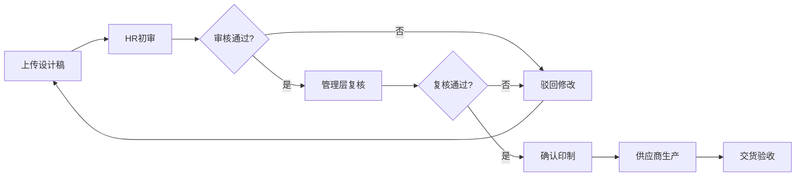

## 1. 产品概述

企业节日礼品采购与定制管理平台，专为HR和行政部门打造的一站式礼品管理解决方案。解决企业节日礼品采购流程分散、定制管理混乱、库存跟踪困难、客户送礼无记录等痛点。

- **核心价值**：打通礼品采购全流程，从方案选择、员工分配、定制审核、物流追踪到库存管理，实现数字化闭环管理
- **目标用户**：HR专员、行政管理人员、销售团队、供应商对接人
- **产品定位**：企业级B2B礼品采购与定制管理SaaS平台

## 2. 核心功能

### 2.1 用户角色

| 角色 | 注册方式 | 核心权限 |
|------|----------|----------|
| 管理员 | 企业账号开通 | 系统设置、用户管理、数据统计、全部功能 |
| HR/行政 | 管理员邀请 | 采购计划创建、礼品分配、库存管理、定制审核 |
| 销售 | 管理员邀请 | 客户礼品记录维护、客户信息管理、提醒查看 |
| 员工 | 企业统一导入 | 个人地址维护、礼品领取查看 |
| 供应商 | 管理员邀请 | 报价提交、方案管理、订单查看 |

### 2.2 功能模块

1. **工作台仪表盘**：数据概览、待办提醒、节日倒计时
2. **采购计划管理**：计划创建、礼品方案选择、员工档位设置、审批流程
3. **礼品方案库**：实物礼盒、电子卡券、定制周边分类管理
4. **定制设计管理**：设计稿上传、在线审核、版本管理、印制确认
5. **员工地址管理**：地址批量导入、分级管理、同步供应商
6. **物流追踪**：批量发货、物流信息同步、签收状态
7. **客户礼品管理**：客户档案、送礼记录、反馈记录、生日/节点提醒
8. **供应商管理**：供应商档案、报价对比、订单管理、评价体系
9. **库存管理**：入库登记、领取发放、库存盘点、未领取跟进
10. **数据统计报表**：采购统计、发放统计、库存统计、费用分析

### 2.3 页面详情

| 页面名称 | 模块名称 | 功能描述 |
|----------|----------|----------|
| 工作台 | 数据概览卡片 | 年度采购金额、本月计划数、待处理事项、库存预警 |
| 工作台 | 节日倒计时 | 重要节日倒计时提醒，快捷创建采购计划 |
| 工作台 | 待办事项 | 待审核计划、待确认设计、待收货订单 |
| 采购计划列表 | 计划列表 | 按状态筛选、搜索、分页、快捷操作 |
| 采购计划创建 | 基本信息 | 节日选择、计划名称、预算设置、时间节点 |
| 采购计划创建 | 礼品选择 | 从方案库选择礼品，支持多方案组合 |
| 采购计划创建 | 档位设置 | 员工级别对应礼品档位，支持按部门/职级批量分配 |
| 采购计划详情 | 计划概览 | 基本信息、进度条、预算执行情况 |
| 采购计划详情 | 员工分配 | 分配名单、导出、调整分配 |
| 礼品方案库 | 分类筛选 | 实物礼盒/电子卡券/定制周边分类 |
| 礼品方案库 | 方案卡片 | 礼品图片、名称、价格、供应商、评分 |
| 礼品方案详情 | 方案信息 | 详细介绍、规格参数、可选配置 |
| 定制设计管理 | 设计稿列表 | 按计划筛选、设计状态、版本管理 |
| 定制设计管理 | 设计审核 | 在线预览、批注、通过/驳回意见 |
| 员工地址管理 | 地址列表 | 按部门/职级筛选、地址完整度统计 |
| 员工地址管理 | 批量操作 | 批量导入、批量导出、批量同步供应商 |
| 物流追踪 | 物流列表 | 批量发货记录、物流状态、签收率 |
| 物流追踪 | 物流详情 | 物流轨迹、签收信息、异常处理 |
| 客户礼品管理 | 客户列表 | 重要客户档案、标签分类、搜索筛选 |
| 客户礼品管理 | 送礼记录 | 时间轴展示、礼品信息、对方反馈 |
| 客户礼品管理 | 提醒设置 | 生日提醒、重要节点提醒、提前天数设置 |
| 供应商管理 | 供应商列表 | 供应商档案、评分、合作状态 |
| 供应商管理 | 报价对比 | 多家供应商报价横向对比，总金额/单价对比图表 |
| 库存管理 | 库存列表 | 按礼品分类、库存数量、预警阈值 |
| 库存管理 | 出入库记录 | 入库登记、领取发放、流水记录 |
| 库存管理 | 未领取名单 | 未领取员工统计、提醒发送、批量跟进 |
| 数据报表 | 采购统计 | 按时间段/节日/部门统计采购金额与数量 |
| 数据报表 | 发放统计 | 发放率、签收率、未领取分析 |
| 数据报表 | 费用分析 | 供应商占比、礼品类型占比、预算执行 |

## 3. 核心流程

### 3.1 节日礼品采购流程

HR在节日前提起采购计划，选择礼品方案，按员工级别设置档位，提交审批后同步供应商发货，员工签收后完成流程。

### 3.2 定制礼品流程

定制礼品需经过设计稿上传、多轮审核、确认印制、生产交付等环节。

### 3.3 客户送礼流程

销售维护重要客户信息，设置生日和重要节点提醒，记录每次送礼详情和对方反馈。

## 4. 用户界面设计

### 4.1 设计风格

- **主色调**：深邃藏青 (#1a365d) 搭配 暖金 (#d4a857)，体现企业级专业感与礼品的节日氛围
- **辅助色**：珊瑚红 (#e07a5f) 用于提醒和强调，薄荷绿 (#81b29a) 用于成功状态
- **中性色**：暖灰色系 (#f8f6f3, #e8e4de, #6b7280, #374151)，营造温暖质感
- **按钮风格**：微圆角 (8px)、轻微悬浮阴影、渐变过渡，精致商务风
- **字体**：标题使用 Noto Serif SC 衬线字体体现品质感，正文使用 Noto Sans SC 保障可读性
- **布局风格**：左侧导航 + 顶部标题栏 + 卡片式内容区，典型企业管理后台布局
- **图标风格**：线性图标，统一 2px 线宽，金色点缀

### 4.2 页面设计概述

| 页面名称 | 模块名称 | UI元素 |
|----------|----------|--------|
| 工作台 | 数据概览 | 渐变卡片、数字动画、图标点缀、悬停微交互 |
| 工作台 | 节日倒计时 | 大号数字、翻牌动画、节日装饰元素 |
| 列表页 | 筛选栏 | 标签式筛选、搜索框、操作按钮组 |
| 列表页 | 数据表格 | 斑马纹、悬停高亮、状态标签、快捷操作 |
| 表单页 | 分步表单 | 步骤指示器、卡片分组、引导文案 |
| 详情页 | 信息卡片 | 分组标题、键值对、标签、状态徽章 |
| 设计审核 | 预览区 | 大图预览、缩放控制、批注工具 |
| 报价对比 | 对比图表 | 横向柱状图、数据高亮、推荐标记 |
| 客户送礼 | 时间轴 | 竖线时间轴、礼品卡片、反馈气泡 |

### 4.3 响应式

- 桌面优先设计，针对 1440px 宽度优化
- 平板端 (1024px) 导航折叠为图标模式
- 移动端不做主要适配，核心页面可浏览
- 表格支持横向滚动，保证数据完整性

### 4.4 视觉细节

- **背景**：浅米色渐变 + 细微噪点纹理，避免单调
- **卡片**：白底 + 细边框 + 柔和阴影，悬停时阴影加深
- **数据展示**：重要数字使用衬线字体，增强品质感
- **节日氛围**：不同节日主题色切换，装饰元素点缀
- **微动效**：卡片入场动画、数字滚动、状态切换过渡
