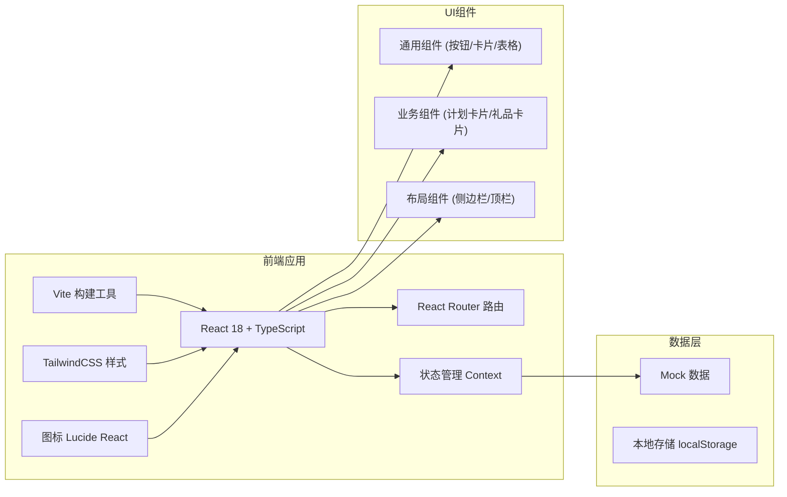
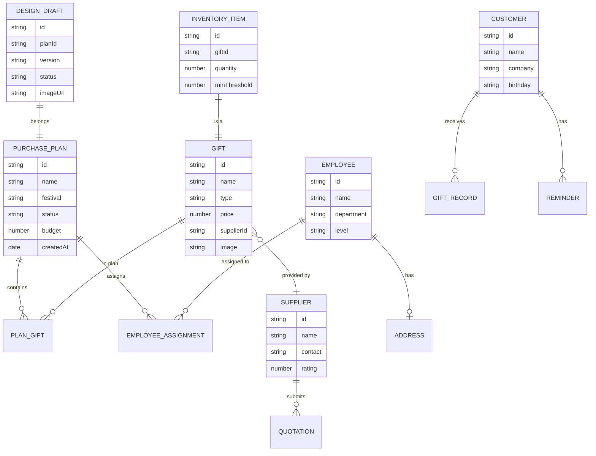

## 1. 架构设计



## 2. 技术描述

- **前端框架**：React 18 + TypeScript 5
- **构建工具**：Vite 5
- **样式方案**：TailwindCSS 3 + CSS Variables 主题
- **路由管理**：React Router v6
- **状态管理**：React Context + useReducer
- **图标库**：Lucide React
- **图表库**：Recharts（用于数据统计报表）
- **日期处理**：date-fns
- **后端**：无后端，使用 Mock 数据模拟
- **数据持久化**：localStorage 存储本地配置

## 3. 路由定义

| 路由路径 | 页面名称 | 说明 |
|----------|----------|------|
| / | 工作台 | 数据概览、节日倒计时、待办事项 |
| /plans | 采购计划列表 | 采购计划管理列表 |
| /plans/create | 创建采购计划 | 分步创建新采购计划 |
| /plans/:id | 采购计划详情 | 计划详情与员工分配 |
| /gifts | 礼品方案库 | 礼品方案浏览与筛选 |
| /gifts/:id | 礼品方案详情 | 方案详细信息 |
| /customize | 定制设计管理 | 设计稿列表与审核 |
| /customize/:id | 设计审核 | 设计稿在线审核 |
| /employees | 员工地址管理 | 员工地址列表与批量操作 |
| /logistics | 物流追踪 | 物流列表与状态追踪 |
| /customers | 客户礼品管理 | 客户列表与送礼记录 |
| /customers/:id | 客户详情 | 客户档案与送礼时间轴 |
| /suppliers | 供应商管理 | 供应商列表与报价 |
| /suppliers/compare | 报价对比 | 多家供应商报价对比 |
| /inventory | 库存管理 | 库存列表与出入库记录 |
| /inventory/unclaimed | 未领取名单 | 未领取礼品员工统计 |
| /reports | 数据报表 | 采购/发放/费用统计图表 |

## 4. 数据模型

### 4.1 数据模型定义



### 4.2 数据结构定义

```typescript
// 采购计划
interface PurchasePlan {
  id: string;
  name: string;
  festival: string;
  status: 'draft' | 'pending' | 'approved' | 'shipping' | 'completed';
  budget: number;
  actualCost: number;
  createdAt: string;
  deadline: string;
  description: string;
  gifts: PlanGift[];
  employeeCount: number;
}

// 计划礼品
interface PlanGift {
  giftId: string;
  giftName: string;
  tier: 'standard' | 'premium' | 'luxury';
  quantity: number;
  unitPrice: number;
  customized: boolean;
}

// 礼品方案
interface Gift {
  id: string;
  name: string;
  type: 'physical' | 'ecard' | 'custom';
  category: string;
  price: number;
  supplierId: string;
  supplierName: string;
  images: string[];
  description: string;
  specs: Record<string, string>;
  customizable: boolean;
  rating: number;
  tags: string[];
}

// 供应商
interface Supplier {
  id: string;
  name: string;
  logo: string;
  contactPerson: string;
  contactPhone: string;
  address: string;
  rating: number;
  status: 'active' | 'inactive';
  categories: string[];
  cooperateSince: string;
}

// 员工
interface Employee {
  id: string;
  name: string;
  department: string;
  level: string;
  email: string;
  phone: string;
  address: Address | null;
  addressComplete: boolean;
}

// 地址
interface Address {
  province: string;
  city: string;
  district: string;
  detail: string;
  zipCode: string;
  receiverName: string;
  receiverPhone: string;
}

// 客户
interface Customer {
  id: string;
  name: string;
  company: string;
  position: string;
  phone: string;
  email: string;
  birthday: string;
  importantDates: ImportantDate[];
  tags: string[];
  level: 'A' | 'B' | 'C';
  avatar: string;
  giftRecords: GiftRecord[];
}

// 送礼记录
interface GiftRecord {
  id: string;
  date: string;
  occasion: string;
  giftName: string;
  giftValue: number;
  feedback: string;
  feedbackRating: number;
  notes: string;
}

// 设计稿
interface DesignDraft {
  id: string;
  planId: string;
  planName: string;
  version: string;
  status: 'pending' | 'approved' | 'rejected';
  imageUrl: string;
  submitter: string;
  submitTime: string;
  reviewer?: string;
  reviewTime?: string;
  reviewComment?: string;
}

// 库存
interface InventoryItem {
  id: string;
  giftId: string;
  giftName: string;
  giftImage: string;
  quantity: number;
  minThreshold: number;
  location: string;
  lastUpdated: string;
}

// 物流订单
interface LogisticsOrder {
  id: string;
  planId: string;
  planName: string;
  trackingNumber: string;
  carrier: string;
  status: 'shipped' | 'in_transit' | 'delivered' | 'exception';
  recipientName: string;
  recipientAddress: string;
  estimatedDelivery: string;
  actualDelivery?: string;
  trackingHistory: TrackingEvent[];
}
```

## 5. 项目目录结构

```
src/
├── assets/              # 静态资源
│   ├── images/
│   └── icons/
├── components/          # 通用组件
│   ├── layout/          # 布局组件
│   │   ├── Sidebar.tsx
│   │   ├── Header.tsx
│   │   └── PageContainer.tsx
│   ├── ui/              # 基础UI组件
│   │   ├── Button.tsx
│   │   ├── Card.tsx
│   │   ├── Table.tsx
│   │   ├── Modal.tsx
│   │   ├── StatusBadge.tsx
│   │   └── Input.tsx
│   └── business/        # 业务组件
│       ├── GiftCard.tsx
│       ├── PlanCard.tsx
│       ├── Countdown.tsx
│       └── Timeline.tsx
├── pages/               # 页面组件
│   ├── Dashboard/
│   ├── Plans/
│   ├── Gifts/
│   ├── Customize/
│   ├── Employees/
│   ├── Logistics/
│   ├── Customers/
│   ├── Suppliers/
│   ├── Inventory/
│   └── Reports/
├── data/                # Mock数据
│   ├── mockPlans.ts
│   ├── mockGifts.ts
│   ├── mockSuppliers.ts
│   ├── mockEmployees.ts
│   ├── mockCustomers.ts
│   └── mockInventory.ts
├── context/             # 状态管理
│   ├── AppContext.tsx
│   └── ThemeContext.tsx
├── hooks/               # 自定义Hooks
│   ├── useCountdown.ts
│   └── useLocalStorage.ts
├── types/               # TypeScript类型
│   └── index.ts
├── utils/               # 工具函数
│   ├── format.ts
│   └── date.ts
├── styles/              # 全局样式
│   └── globals.css
├── App.tsx
├── main.tsx
└── vite-env.d.ts
```

## 6. 主题配置

```css
:root {
  --color-primary: #1a365d;
  --color-primary-light: #2c5282;
  --color-accent: #d4a857;
  --color-accent-light: #e8c884;
  --color-success: #81b29a;
  --color-warning: #f2cc8f;
  --color-danger: #e07a5f;
  --color-bg: #f8f6f3;
  --color-surface: #ffffff;
  --color-text: #374151;
  --color-text-light: #6b7280;
  --color-border: #e8e4de;
  --font-display: 'Noto Serif SC', serif;
  --font-body: 'Noto Sans SC', sans-serif;
  --radius-sm: 4px;
  --radius-md: 8px;
  --radius-lg: 12px;
  --shadow-sm: 0 1px 2px rgba(0, 0, 0, 0.05);
  --shadow-md: 0 4px 12px rgba(0, 0, 0, 0.08);
  --shadow-lg: 0 10px 30px rgba(0, 0, 0, 0.1);
}
```
